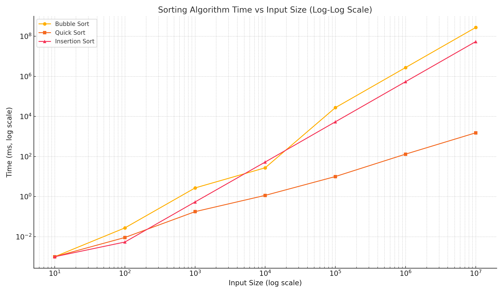

# Ghi chú học lập trình cơ bản

### Trình độ: Beginner

---

## Operating System (Hệ điều hành)

- Quản lý phần cứng và phần mềm, bộ nhớ, tiến trình, file, thiết bị
- Cung cấp giao diện người dùng (UI) và thực thi ứng dụng

### Kernel (Nhân hệ điều hành)

- Phần lõi dùng low-level code điều khiển phần cứng
- Quản lý bộ nhớ, tiến trình, driver, bảo mật và quyền truy cập

### Chipset (Tập hợp các chip trên motherboard)

- Giúp CPU giao tiếp với RAM, USB, PCIe, GPU, v.v.
- Điều phối hoạt động giữa CPU và các bộ phận khác

---

## CPU vs GPU

### CPU (Central Processing Unit)

- Ít lõi nhưng lõi mạnh
- Dành cho các tác vụ chung như Word, hệ điều hành, trình duyệt

### GPU (Graphic Processing Unit)

- Nhiều lõi nhưng yếu hơn
- Dành cho render game và huấn luyện AI model

### Tại sao GPU dùng cho AI?

- Tính toán song song với ma trận, vector rất hiệu quả
- Tối ưu để làm cùng phép tính trên nhiều dữ liệu
- Băng thông bộ nhớ cao hơn CPU

---

## Kiến trúc phần cứng

### AMD (CISC)

- Hiệu suất đơn luồng cao, tiêu thụ điện nhiều
- Phù hợp với máy tính hiệu năng cao, gaming

### ARM (RISC)

- Tiết kiệm điện năng
- Dùng cho laptop, tablet
- Hiệu suất đơn luồng thấp hơn

---

## Data Structures & Algorithms

### Time Complexity (Độ phức tạp thời gian - Big O)

- Đo số bước thực hiện trong trường hợp tệ nhất
- Ví dụ: Binary Search là `O(log n)` vì mỗi lần chia đôi mảng

> Chỉ dùng được nếu mảng đã sắp xếp

### Algorithms (Thuật toán)

#### Merge Sort:
- Chia nhỏ mảng → sắp xếp → ghép lại
- Chia `log n` lần, mỗi lần ghép `O(n)` → `O(n log n)`

**Minh hoạ:**
```
[38, 27, 43, 3, 9, 82, 10]
↓
[38, 27, 43]     [3, 9, 82, 10]
↓
[38] [27, 43]    [3, 9] [82, 10]
↓
[27] [43] → [27, 43] → [27, 38, 43]...
```

#### Selection Sort:
- Tìm phần tử nhỏ nhất tiếp theo rồi đổi chỗ
- `O(n)` lần tìm × `n` phần tử → `O(n²)`

**Minh hoạ:**
```
[5, 3, 6, 2, 1]
↓ (chọn nhỏ nhất: 1)
[1, 3, 6, 2, 5]
↓ (chọn nhỏ nhất trong phần còn lại)
[1, 2, 6, 3, 5]...
```

---

## Data Structures

### Array (Mảng)
- Bộ nhớ liên tiếp
- Truy cập nhanh qua index
- Kích thước cố định

### Linked List
- Gồm node và con trỏ đến node kế tiếp
- Có thể thêm/xóa node dễ dàng mà không cần dời dữ liệu

### Binary Tree
- Mỗi node có tối đa 2 node con
- Node trái < node mẹ, node phải ≥ node mẹ
- Trung bình `O(log n)` cho tìm kiếm/thêm/xoá

**Minh hoạ:**
```
      8
     / \
    3   10
   / \    \
  1   6    14
```

### Heap (Priority Queue)
- Dạng cây dùng mảng
- Min-heap: con nhỏ hơn hoặc bằng cha
- Max-heap: con lớn hơn hoặc bằng cha
- `Insert/Delete`: `O(log n)`; `get min/max`: `O(1)`

**Minh hoạ (Min-heap):**
```
       2
     /   \
    4     3
   / \   /
  5   9 6
```
### Dictionary / HashMap
- Cấu trúc lưu trữ dữ liệu theo cặp `key-value`
- Truy cập cực nhanh bằng cách dùng key
- Dùng hàm băm (hash function) để tìm vị trí lưu trong bộ nhớ

**Ví dụ (Python):**
```python
person = {
    "name": "Alice",
    "age": 25,
    "is_student": True
}
print(person["name"])  # Alice
```

### Time Complexity:
- Tìm kiếm / Thêm / Xoá trung bình: `O(1)`
- Trường hợp tệ nhất (nhiều va chạm - collision): `O(n)`

**Minh hoạ thực tế:**
```
Danh bạ: {"John": "123-456", "Emma": "789-123"}
Từ điển từ: {"cat": 3, "the": 5, "sat": 2}
```

---

## Tree Traversals

### DFS (Depth First Search)
- Duyệt theo chiều sâu
- Dùng **stack** (thêm/xoá ở cuối)

**Minh hoạ:**
```
DFS: 1 → 2 → 4 → 5 → 3
```

### BFS (Breadth First Search)
- Duyệt theo từng lớp
- Dùng **queue** (thêm cuối, xoá đầu)

**Minh hoạ:**
```
BFS: 1 → 2 → 3 → 4 → 5
```

---

## Stack Overflow là gì?
- Xảy ra khi dùng quá nhiều bộ nhớ stack (thường do đệ quy sâu)

---

## Graph (Đồ thị)

- Cấu trúc gồm **đỉnh (node)** và **cạnh (edge)**

### Các loại đồ thị:
- **Directed graph**: cạnh có chiều
- **Undirected graph**: cạnh hai chiều
- **Unweighted**: không có giá trị
- **Weighted**: có trọng số

**Minh hoạ:**
```
Directed:
A → B → C

Undirected:
A — B — C
```

---

## Dijkstra's Algorithm

### Ý tưởng:
1. Đặt khoảng cách đỉnh bắt đầu = 0, còn lại là ∞
2. Dùng **min-heap** để chọn đỉnh gần nhất
3. Duyệt các đỉnh kề, cập nhật đường đi ngắn hơn nếu có

### Time Complexity:
- Khởi tạo khoảng cách: `O(V)`
- Mỗi đỉnh vào heap: `O(V log V)`
- Mỗi cạnh có thể cập nhật: `O(E log V)`
- **Tổng cộng**: `O((V + E) log V)`

**Minh hoạ:**
```
Graph:
A --1-- B --2-- C
 \     /
  4   3
   \ /
    D

Start: A
Output distances:
A: 0
B: 1
C: 3
D: 4
```


## Time Complexity Summary

| Input Size | Bubble Sort     | Quick Sort      | Insertion Sort   |
|------------|------------------|------------------|------------------|
| 10         | 0.27 µs          | 0.9 µs           | 0.05 µs          |
| 100        | 27.4 µs          | 9.1 µs           | 5.4 µs           |
| 1,000      | 2.7 ms           | 177 µs           | 0.54 ms          |
| 10,000     | 27.4 ms          | 1.149 ms         | 53 ms            |
| 100,000    | 27,383 ms (27 s) | 10 ms            | 5,383 ms (5.4 s) |
| 1,000,000  | 45.6 min         | 131 ms           | 9 min            |
| 10,000,000 | 76 h             | 1.52 s           | 15 h             |


## Graph: Time vs Input Size (Log-Log Scale)



### Observations:
- **Bubble Sort** and **Insertion Sort** perform well on small datasets but degrade drastically on larger ones.
- **Quick Sort** scales efficiently, staying performant even at 10 million elements.


## 📦 Requirements

For generating the graph:
```bash
pip install matplotlib
